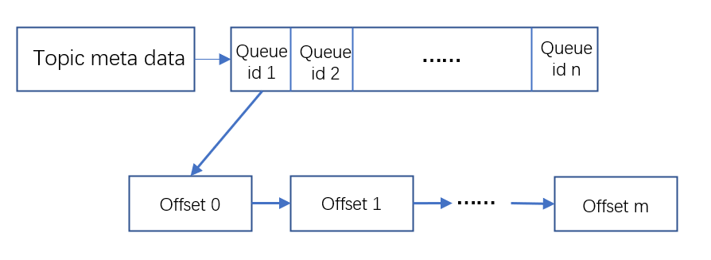
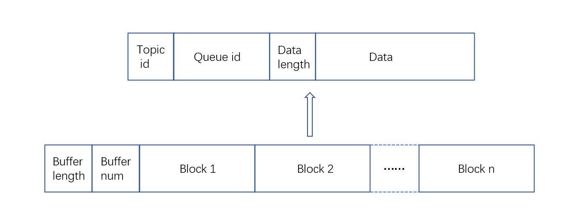
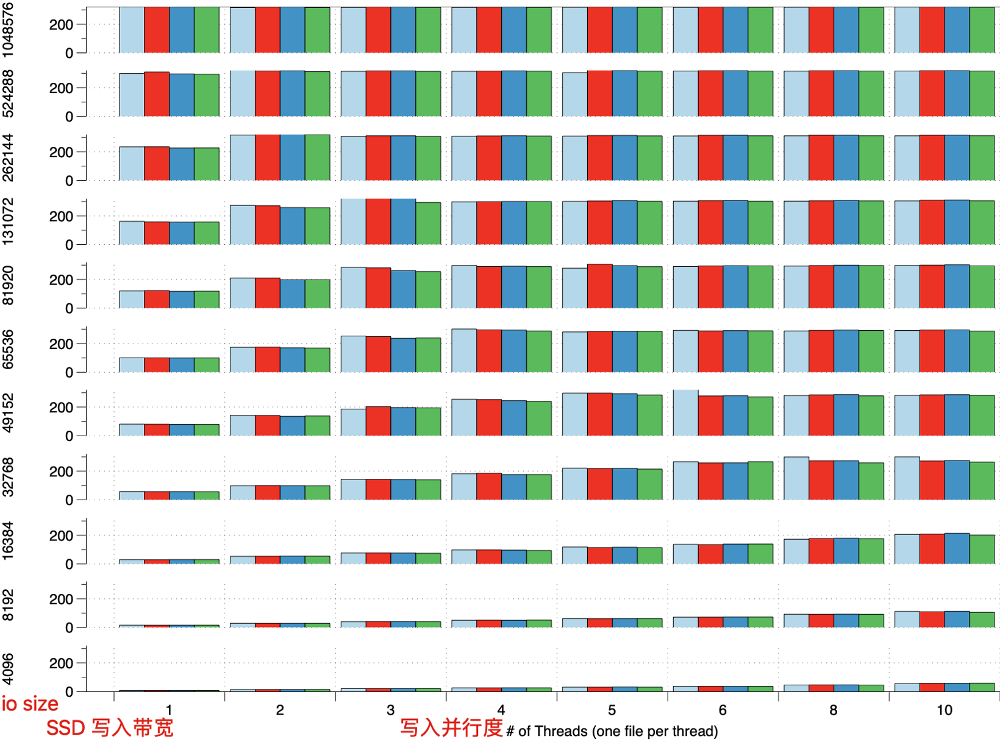
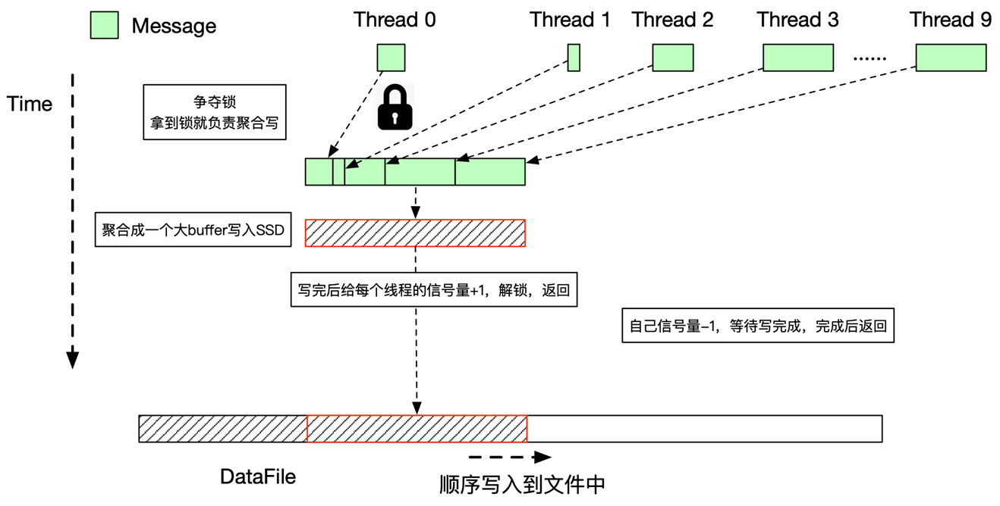
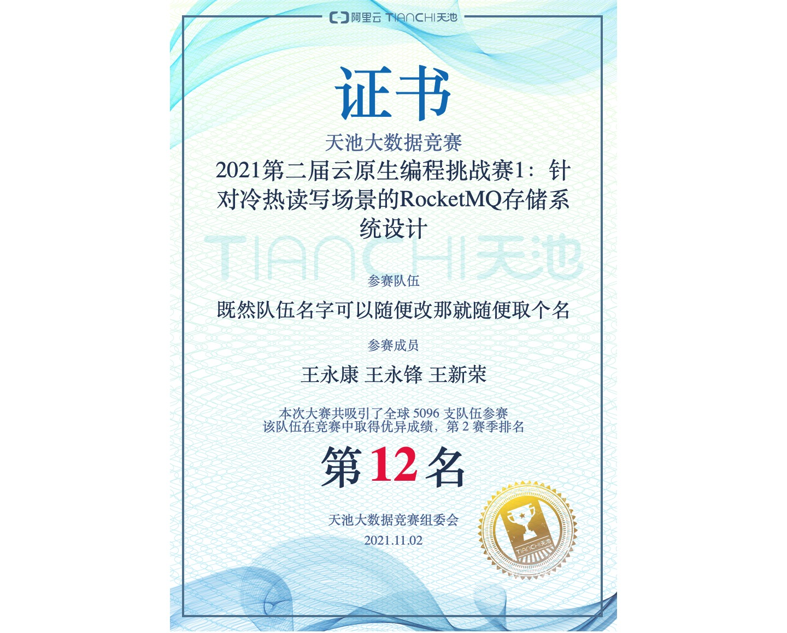

# 针对冷热读写场景的RocketMQ存储系统设计

这是一个关于阿里天池的[比赛](https://tianchi.aliyun.com/competition/entrance/531922/information)的项目, 比赛的要求大致如下：
> 实现一个单机存储引擎，提供以下接口来模拟消息的存储场景：
> - 写接口 long append(String topic, int queueId, ByteBuffer data) 返回的long值为offset，不允许为null，用于从这个topic+queueId中读取这条数据，offset要求topic+queueId维度内严格递增，即第一条消息offset必须是0，第二条必须是1，第三条必须是2，第一万条必须是9999。
>
> - 读接口 Map<Integer, ByteBuffer> getRange(String topic, int queueId, long offset, int fetchNum) 其中fetchNum最大不超过100，返回值中的key为offset（offset为消息在Map中的顺序偏移，从0开始），value为对应的写入data。读到结尾处没有新数据了，要求返回空Map。
> 评测环境中提供60G的傲腾持久内存，鼓励选手用其提高性能。
>
> 语言限制：Java。

评测分为性能评测和正确性评测，其中性能评测的方式如下：

> 评测程序会创建10~50个线程，每个线程随机若干个topic（topic总数<=100），每个topic有N个queueId（1 <= N <= 5,000），持续调用append接口进行写入；评测保证线程之间数据量大小相近（topic之间不保证），每个data的大小为100B-17KiB区间随机（伪随机数程度的随机），数据几乎不可压缩，需要写入总共75GiB的数据量。
>
> 保持刚才的写入压力，随机挑选50%的队列从当前最大点位开始读取，剩下的队列均从最小点位开始读取（即从头开始），再写入总共50GiB后停止全部写入，读取持续到没有数据，然后停止。

正确性评测方式如下：

> - 写入若干条数据。
> - 重启ESC，并清空傲腾盘上的数据。再读出来，必须严格等于之前写入的数据。

硬件限制：机器4核8G内存，400GiB SSD(320MiB/s), 60GiB PMEM, JVM 6GiB 堆内 + 2GiB 堆外内存

比赛最终在 11.2 结束，我们的成绩也最终定在了 12 名。
我们打算从以下 3 个方面来介绍我们的项目。

## 系统设计

由于赛题在正确性阶段会在重启并清空 PMEM，然后再进行正确性测试，所以必须保证较高的一致性：每次 append 函数返回之前必须保证数据成功写入 SSD 持久化。因此系统的设计也是基于 SSD 存储。

### 数据在 SSD 上的组织

我们有过许多数据存储在 SSD 上方案的尝试。最初的朴素想法是：为确保写入的数据能在断电后恢复读出来，将数据链式存储在 SSD 上。



即 topic 下存 queueId 数组，然后每个 queueId 下存同一个 queue 的数据链表。这样可以非常容易实现恢复的过程。

这种存储方式结合后面的一些优化方案，使我们成功拿下一血（第一个分数：1714691）。


随着优化的深入，我们发现这种存储方式的不足：每次写入数据都将带来 SSD 的随机小写（需要更新链表的尾指针）会严重影响写入的带宽。于是我们想到（主要是王老师想到）可不可以完全摒弃这种随机小写呢？于是更换了数据在 SSD 上的组织形式：直接把四元组 `<topic, queueId, dataLength, data> ` 存在 SSD 上就好了，写入的时候采用写日志的方式追加写入，而恢复的时候遍历整个磁盘就行。当然这种做法相当于数据随机存在磁盘上，所以对 getRange 读是不友好的。我们也非常像样给这种方式取名 `LSMessageQueue`(日志结构消息队列)。

于是我们把基于链表的组织方式修改为基于日志的组织方式，见下图：



（至于 buffer length 与 buffer num 是怎么来的呢？下面的写聚合部分会介绍到）

这一设计直接使得我们的成绩从`1571210ms`迈步到了`1049043ms`。这也再次提醒了我们关于数据结构设计的重要性。

## 优化方案

这部分内容是整个比赛的核心内容，我们的优化思路也很简单：先把写优化到极致，然后再优化读部分。主要做的优化如下：

### 写聚合

由于本次比赛是写密集型的场景，比如第一个阶段就有 40 个线程同时写入数据，而 SSD 的一个特点就是：对大量数据的写入友好，所以尽可能避免随机小写，减少写放大。以下是对比赛的 SSD 进行 benchmark 测试的一个结果：



一开始我们借鉴了 LevelDB 的 Memtable 批量写入的思路。

把每个线程的写SSD任务封装成 Writer，在写入之前 Writer 会加入到队列中。多个线程会在写之前竞争锁，只有第一个获得锁的进程（例如下图的 Thread 0）才能继续进行，其他进程会休眠。然后 Thread 0 会将队列中的每个 Writer 需要写入的数据聚合在同一个 buffer 并写入 SSD（写入时会加入一些元数据，即上述的buffer length 与 buffer number）。写完之后 Thread 0 会修改队列中其他线程的状态，告知它们写入任务已完成，之后唤醒其他线程。 

大致的代码思路如下：

```java
public DataMeta writeAgg(ByteBuffer data){
    lock.lock();
    Writer w = new Writer(data);
    try {
        writerQueue.addLast(w);
        while (!w.done && !w.equals(writerQueue.getFirst())) { 
            w.cv.await();
        }
        if (w.done) {
            return w.meta;
        }

        // 执行批量写操作
        Iterator<Writer> iter = writerQueue.iterator();
        Writer lastWriter = w;
        while (iter.hasNext()) {
            lastWriter = iter.next();
            /* put Metadata And Data To writer buffer; */
        }

        // 写期间 unlock 使得其他 writer 可以被加入 writerQueue
        {
            lock.unlock();
            /* use fileChannel to write buffer and then force */
            lock.lock();
        }

        while (true) {
            Writer ready = writerQueue.removeFirst();
            if (!ready.equals(w)) {
                ready.done = true; // 标记其他 writer 的状态为 done
                ready.cv.signal();
            }
            if (ready.equals(lastWriter)){
                break;
            }
        }

        // 队伍不为空则唤醒队列中队首的 writer
        if (!writerQueue.isEmpty()) {
            writerQueue.getFirst().cv.signal();
        }
    } catch (InterruptedException | IOException e) {
        e.printStackTrace();
    } finally {
        lock.unlock();
    }
    return w.meta;
}
```

示意图如下：



这种写聚合方式的优点在于能够减少写 SSD 的次数，提高性能；同时当写请求很少时，当前待写入的进程能够快速发起写操作而不需要长时间等待其他线程来聚合。

之后的设计中我们将加锁保护队列的方案修改为`无锁队列`方案，去掉了`lock() 与 unlock()`而采用支持并发的队列`ConcurrentLinkedQueue`来保护队列。

之后我们从火焰图中发现写入阶段中`park()`与`unpark()`占据了不少的比例（线程等待写入时会挂起的开销），最后又修改为争夺锁的方案，具体表现为当线程抢不到锁时它可以先去完成其他任务（例如拷贝热数据），而后再等待抢到锁的线程来完成写聚合任务。

大致代码思路如下：

```java
public long append2(ByteBuffer data){
    Writer w = new Writer(data);
    DataFile df = mqTopic.df; 
    
    if(df.lock.tryLock()){ // tryLock() 获取锁失败则返回 false, 不会阻塞线程
        /* batch write in lock */
        
        df.lock.unlock(); 
    }
	
    /* do other work */

    // 检查写入任务是否完成，如果没有完成则： 1) 等待完成 2）自己主动尝试获取锁去完成
    try {
        // 注意：在batch write期间会连续执行 writer.sema.release(1)；write.done = 1；
        // 故下面若 tryAcquire 返回 true 则说明 writer.done == 1
        if (!w.sema.tryAcquire(1, 500*1000, TimeUnit.MICROSECONDS)){ // 等待一段时间后依旧未完成任务
            if (w.done != 1){
				df.lock()
                
                /* batch write in lock */
				
                df.lock.unlock(); 
            }
            w.sema.acquire(); 
        }
    } catch (Exception ie){
        ie.printStackTrace();
    }
}

```

LevelDB 类似的队列聚合 Writer 的方案平均带宽大概是 `220MiB/s `，无锁队列方案的平均带宽大概是 `265MiB/s`，最后的争夺锁的方案平均带宽大概是 `275MiB/s`。

### 分文件

经过对 SSD 的 benchmark 测试，可以发现 SSD 分不同的区域并行写入时性能更高。所以在写入SSD分 4 个文件写入，通过`线程id mod 4`的方法选择写入的文件。同时也对写入的 buffer 进行了 4K 对齐。

### 热数据缓存

读阶段分为了冷读和热读，热读是指每条队列都从最大位点开始读取，因此针对热读我们仅需要缓存较少的热数据，就可减少访问 SSD 的次数。我们选用了大概1.4G的堆外内存来缓存，堆外内存提供不同大小的 slot（4K, 8K, 12K, 17K）来存放不同大小的数据。

### PMEM 的使用

至于冷读，我们考虑在纯写入的阶段将所有写入的数据同时写入到 Pmem 上，当 Pmem 空间不足就停止写入。在读写混合阶段，通过当前队列第一次访问是否从 offset = 0 开始来识别是否为冷队列。如果为冷队列则从 Pmem 中读取数据。

在写入 Pmem 时我们依旧采用了双缓冲区的方案。数据先写到 DRAM 的缓冲区上，当缓冲区满时开启一个异步线程写到 Pmem 上同时切换为另一个缓冲区供写入。

之后我们发现（主要是王老师发现）Linux 分配空间是 lazy 的，因此在一开始访问 Pmem 时会出现一些缺页中断。由此我们可以在初始化阶段通过刷 Pmem 来减少后续访问 Pmem 带来的缺页中断。

当然这种使用 Pmem 的方案在于读取数据之后没能释放掉 Pmem 的空间，空间的利用率不高，使得最终冷读还是不可避免地会去访问 SSD。

此外由于读的速度远比写的快，在后期冷队列为转为热队列（即读取的 offset 跟上了最新写入的 offset），因此我们也做了判断，当冷读访问的 offset 与当前队列的最大 offset 很接近时，将该队列标记为热队列，改为从 DRAM 中读取数据。

### 其他

此外还有一些零碎的优化，如设计 buffer 池分配机制来复用 buffer，减少 GC 的次数。

~~比较遗憾的是，我们也考虑到了预分配 SSD 上的文件的空间，但并没有全部初始化为 0，而是直接修改文件的 position 为一个很大的值并写入少量内容，由此来预分配文件的空间。按照 Kirito 大佬的赛后总结，把 SSD 上的文件全部填充为 0，或许还能给我们带了一些额外的优化。~~

## 最终结果

后期云上面的机器波动很大，这也给我们的优化带来了一些麻烦。经过了各种优化我们的最终成绩定格在了`582069ms`，排名12。



## 后记

由于我们都是算是 Java 新手，都不怎么会这么语言，但正如本科老师说的：计算机系的学生，一周就应就会一门语言。确实如此，通过从这比赛真就从入门到精通。而且很多时候一些改动自己想当然地认为能带来优化，但或许会表现平平甚至负优化，很多时候我们需要去多做测试，包括对 SSD、Pmem 的 benchmark，即所谓的“大胆假设，小心求证”。